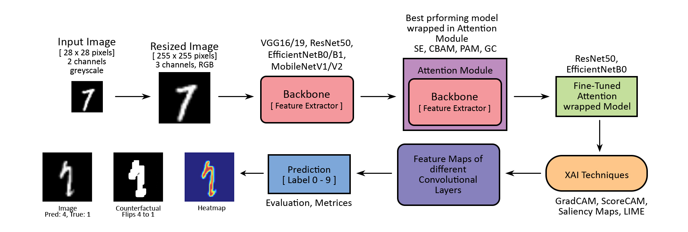
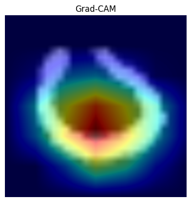
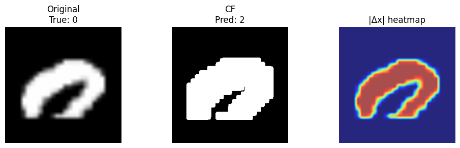
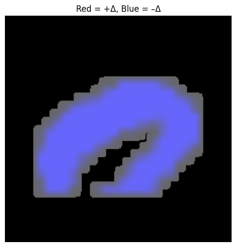

# Attention-Enhanced CNNs with Contrastive Counterfactual Explanations on MNIST

This repository contains the implementation and research for a project that investigates the integration of **attention mechanisms** and **contrastive counterfactual explanations** into convolutional neural networks (CNNs) for digit classification on the MNIST dataset. The goal is to bridge the gap between predictive performance and interpretability using **state-of-the-art XAI techniques**.

> *"Understanding why models make mistakes is as important as how accurate they are, and for that we have to see what they 'see' and don't 'see'!"*  
> — Project Motivation

---

## Project Overview

In critical domains like healthcare, finance, and law, understanding the **reasoning behind AI decisions** is crucial. This project aims to make deep learning models more transparent and interpretable without sacrificing accuracy.

Key components:
- **Benchmarking and fine-tuning** of pretrained CNN backbones (ResNet50, EfficientNetB0, MobileNetV2, etc).
- Integration of **attention modules** (SE, CBAM, PAM, GC) to enhance interpretability.
- Generation of **contrastive counterfactuals** to visualize decision boundaries.
- Use of popular XAI techniques including Grad-CAM, Score-CAM, SmoothGrad, and LIME.

---

## Experimental Highlights

| Module              | Accuracy ↑ | Test Loss ↓ | Params     | Notes                               |
|---------------------|------------|-------------|------------|--------------------------------------|
| ResNet50 + CBAM     | 98.9%      | 0.060       | ~24M       | High accuracy, large size            |
| EfficientNetB0+CBAM | 97.05%     | 0.088       | ~4.4M      | Excellent accuracy-to-size ratio     |
| MobileNetV2 + CBAM  | 97.60%     | 0.068       | ~2.6M      | Lightweight and fast                 |

<br>
Contrastive explanations help answer:<br>

> *"What minimal change would flip the model’s wrong prediction?"*

---

## Repository Structure

```
├── final_notebook.ipynb              # Final implementation and results
├── Attention-Enhanced CNNs...pdf     # Research report and documentation
├── data/                             # Data, metrics CSVs
├── init_research/                    # Initial experiments, baselines, logs
├── notebooks/                        # Research notebooks, ablation studies
├── requirements.txt                  # Libraries and imports used
└── README.md                         # Project overview and usage
```

---

## Methodology

### 🔍 Model Architectures



- Experiemneting on backbones like VGG, ResNet, EfficientNet, MobileNet on 255x255 RGB-MNIST.
- Attention Wrappers: `SE`, `CBAM`, `PAM`, `GC` — modularly attached to CNN backbones.
- Fine-tunning the attention-wrapped Final models and exporting them as Native Keras models.

### 📊 Explainability Techniques
- **Attribution Methods**: Grad-CAM, Score-CAM, LIME, SmoothGrad
- **Counterfactuals**: 
  - Growing Spheres (black-box)
  - Gradient-based optimization (white-box)
  - Overlay visualizations for human-centered interpretability

### 🔁 Training & Evaluation
- Optimizer: Adam, LR scheduler: ReduceLROnPlateau
- Data Augmentation: rotation, translation, elastic distortion
- Evaluation Metrics: Accuracy, Test Loss, Perturbation Norm, Visual Clarity

---

## Sample Outputs

| Original Image | Grad-CAM | Counterfactual | Overlay |
|----------------|----------|----------------|---------|
|  |  |  |  |

> Counterfactuals show *how close* the image was to being classified differently.

---

## 📦 Setup Instructions

1. Clone the repository:
   ```bash
   git clone https://github.com/your_username/xai-contrastive-cnn.git
   cd xai-contrastive-cnn
   ```

2. Create a virtual environment:
   ```bash
   python3 -m venv venv
   source venv/bin/activate
   pip install -r requirements.txt
   ```

3. Launch Jupyter Notebook and run:
   ```bash
   jupyter notebook notebooks/
   ```

> Recommended environment: Google Colab with T4 GPU

---

## The Team

<a href="https://github.com/trisha-rc" target="_blank"></a>
<a href="[profile link]" target="_blank"></a>


```javascript
const Contributors = [
  {
    name: "🐐 trisha-rc",
    roles: ["Analyst", "Documenter"]
  },
  {
    name: "username",
    roles: ["role", "role"]
  }
];
```

---

## 📬 Contact

For questions, feedback, or collaboration, reach out at:


📧 [Mail](mailto:trisha.rc888@gmail.com) <br>

---

## Keep Coding 🚀
